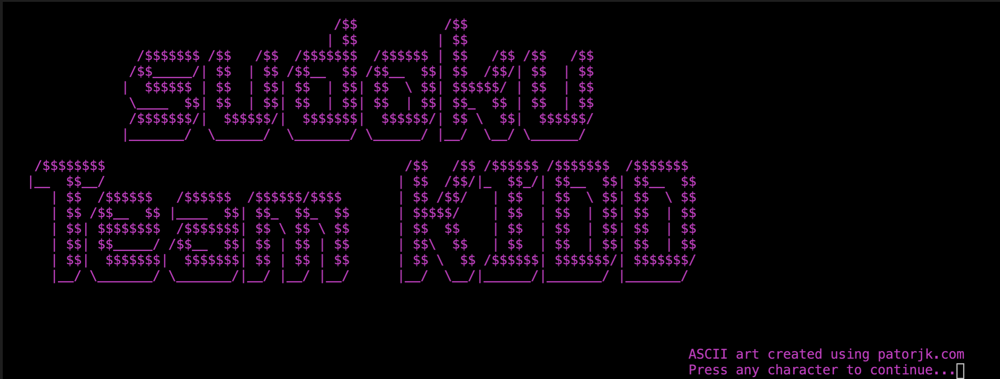
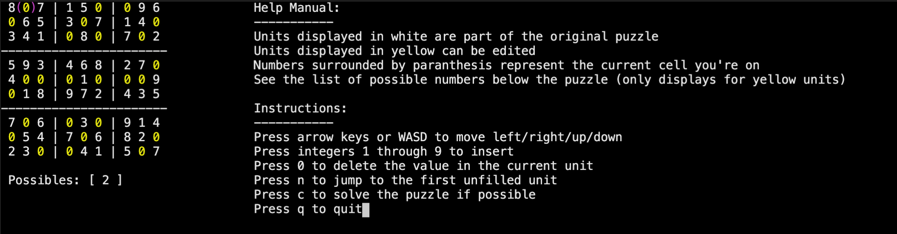
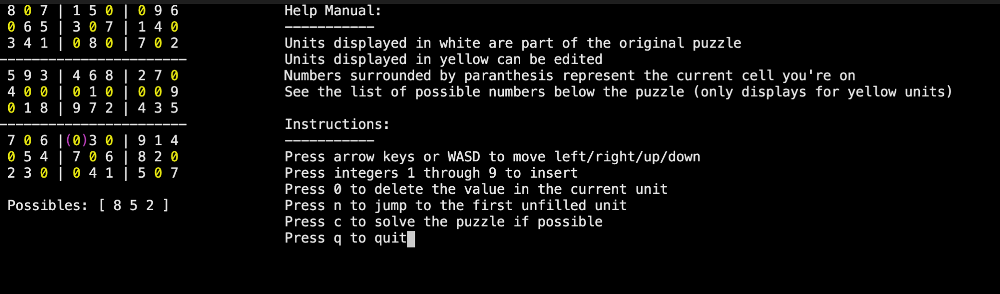
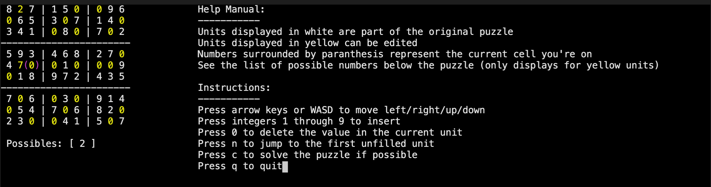
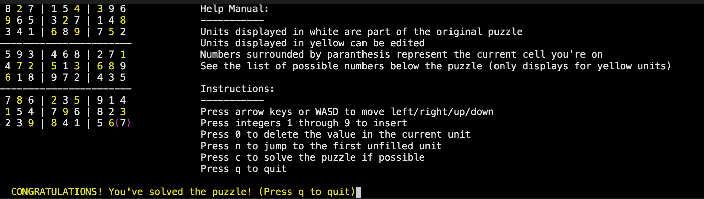

# Extra Credit: Terminal Interaction using the ncurses library



This program is essentially an ncurses interactive sudoku game, in which users can navigate through the puzzle using their keyboard. The program displays the possibles list for each editable unit (i.e. not part of the original puzzle) and will display a congratulations message when complete.

### Features!
The interactive puzzle allows users to maneuver through the terminal. Upon generating the puzzle, the program will automatically bring the user to the first unfilled unit. For the user's convenience, everything displayed in white cannot be edited -- they are either instructions or part of the original puzzle. (Objects in white include the original puzzle, help manual, and possibles list). Units displayed in yellow were originally unfilled and should be edited based on the rules of sudoku. Paranthesis displayed in magenta track the user's current location, and can be moved using the arrow keys or a/w/s/d keys.



The program allows the user to move their cursor, which will update the possibles list automatically. 



To complete the puzzle, users should insert a number from 1 through 9 in each yellow unit, or delete if necessary. A possibles list is displayed at the bottom to help the user keep track of the numbers that can be filled at any given unit (removing values that displayed in the unit's row/column/box).



Upon completing the puzzle (or pressing `c` to automatically generate a solution, if any), the program will display a congratulatory message for the user noting that the puzzle has been completed.



To exit the program, the user can simply press `q` to quit. 

### Usage

The *interface* module, implemented in `interface.c`, interacts with the user's keyboard commands using the following methods:

```c
void print_help();
void pprint(puzzle_t *puzzle, unit_t* current_unit);
void splash_screen();
bool validate_inputs(int num_inputs, char* filename);
int main(const int argc, char *argv[]);
```

Please run the following commands in your terminal for color:
```c
export PS1='\[\033[1;36m\]\u\[\033[1;31m\]@\[\033[1;32m\]\h:\[\033[1;35m\]\w\[\033[1;31m\]\$\[\033[0m\]'
export force_color_prompt=yes
```

Please follow the following instructions to run the program:
1. Navigate to the `ncurses` directory (if you're in the main directory, type `cd ncurses`)
2. Make the directory using `make`
3. Run the program using `./interface` 
4. Enjoy!

### Implementation

The program is built using the `ncurses` library. Upon running the program, users are brought to our team's splash screen, whereupon clicking any key will bring them to the interactive sudoku puzzle. Using the arrow keys or w/a/s/d keys, users are able to move their cursor throughout the puzzle, and insert/delete in certain units accordingly. The original puzzle is displayed in white, and the units to be filled in are displayed in yellow. A possibles list shows up upon however over any yellow unit, which shows the user the possible numbers for that unit. A help manual is also always displayed on the side for the user's convenience.

The `interface` module implements the following methods:

```c
/******* pprint ********/
/** Pretty prints the entire program
 * Inputs: puzzle to print, current unit the player is on
 * Output: none (prints to terminal)
 */
void pprint(puzzle_t *puzzle, unit_t* current_unit);

// Prints the help manual detailing the instructions
void print_help();

/******* splash_screen ********/
/**
 * Prints a spalsh screen of our team :)
 * All credits to patorjk.com for translating the text to ASCII characters
 * Inputs/Outputs: none
 */
void splash_screen();

/**
 * validates the inputs for the main
 * Inputs: number of inputs, filename of puzzle
 * Output: true is success, false otherwise
 */
bool validate_inputs(int num_inputs, char* filename);

/******* main ********/
/** Main method to run the program
 * Manages the user's actions on the puzzle 
 * Inputs: none
 * Output: 0 if success, otherwise failure
 */
int main(const int argc, char *argv[]);
```

### Pseudocode
1. Load the file into a `puzzle` struct
2. Initialize `ncurses` library
3. Color the puzzle (for the current puzzle, paranthesis, original puzzle, and units to be filled in were designated three different color pairs)
4. Add the splash screen (optional)
5. Allow keypad support
6. Find the next unfilled unit
7. Run the program
    1. Print the puzzle
    2. Refresh
    3. Get the user's next character
        1. Allow support for mouse movement based on arrow keys and a/w/s/d
        2. Allow support for first unfilled unit (n)
        3. Allow support for deleting a unit
        4. Allow support for inserting into an unfilled unit (designated in yellow)
        5. Allow support to solve the puzzle for the user
    4. Allow support to quit the puzzle interface
    5. Refresh and endwin as needed

### Assumptions

As this is extra credit, I (Irene Lam) assumed that a detailed IMPLEMENTATION.md and DESIGN.md were not necessary. I have, however, included pseudocode and brief implementation details on how I used the ncurses library.

Additionally, the ncurses library comes with memory leaks (a lot...). I assumed that all memory leaks innate to using the methods of the program (e.g. `initscr()`, `refresh()`, `endwin()`) could be ignored. 

### Files

* `Makefile` - compilation procedure
* `interface.c` - the implementation file
* `interface.h` - the header file 
* `images/` - directory of images that showcase the program

